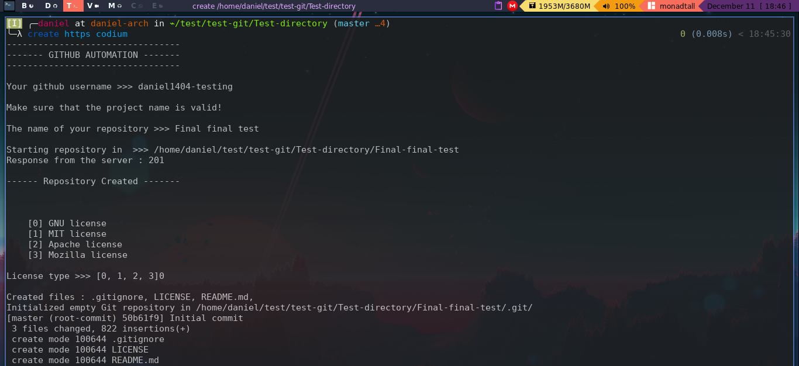

# Github automation ☕

This is a program that help you to automate the boring process of creating a project on github.😪 

## Steps you are avoiding :

You are saving a lot of time by using a github automation tool. You are skipping:

1. Create a repo in the Github Website
2. Create the header of the **README** and pasting the **LICENSE**
3. Doing the boring stuff with git:
    
    * Git init
    * Git add . 
    * Git commit -m
    * Git add remote


## Dependencies

* Python3
* Git

Also you need a **github access token**. You can find it by **Going to your Settings > Developer settings > Personal access tokens > Generate access tokens**.

I selected the repo and Workflow boxes.

## Installation

First you need to clone the repository:

```
git clone https://github.com/Daniel1404/Github-automation.git
```
Then make the installation process:

```
cd Github-automation
```

```
./install.sh
```
Now the program should be copied in .local/share/Github-automation, so you could erase the current directory.

## Set up 

By default you just need to create a folder named **/Auth** in your home directory, and paste your github token in the first line of a new file named **githubapi.txt**.📁

You can do it with the following commands:

```
cd ~
mkdir Auth
cd Auth/
cat >> githubapi.txt <<EOF
"YOUR TOKEN IN THE FIRST LINE"
EOF
```

You could also insert your token, directly in the source code. But remember to run **./install.sh**
again.

🔴 WARNING❗🔴: I know that having your token in a plain text file, would be risky. So I will try to do something in this aspect.

## Usage


Now that setup is done, type create in your terminal.

```
create
```

This will call the **[create.py](https://github.com/Daniel1404/Github-automation/blob/main/create.py)** file.

This will ask you for your Github username and the name of the repo you want to create.

Also you will be asked for choose a License, by default is included the 
[Gnu license](https://choosealicense.com/licenses/gpl-3.0/), the [Mozilla license](https://www.mozilla.org/en-US/MPL/2.0/), the  [MIT
license](https://choosealicense.com/licenses/mit/) and the [Apache license](https://choosealicense.com/licenses/apache-2.0/).

If there are not problems, you should have a remote repository created, anda folder in the current
directory with the README, a License file and a .gitignore (By default Python).

## Command line options

* Remote type:
    By default the remote type of the project is **ssh**, but you can change it to https with the command line argument **https**.
    ~~~
    create https
    ~~~
* Code editor: The script open the created project with your default editor, but you can change it
    with a command line argument.
    ~~~
    create codium
    ~~~
    For example here a I will create a project and open it with Vscodium.

Of course you could use both arguments, it would be something like this.
~~~
create https pycharm
~~~
This will create a project and open it in Pycharm editor.

## Screenshot 💻



That's all.

## TO-DO's

* ✅Implement License choose, since the default license is always the MIT license
* ⏳Find a more secure way to use the token
* ⏳Make it usable in Windows.
* ✅Implement a text editor choice in installation process. (Done)

